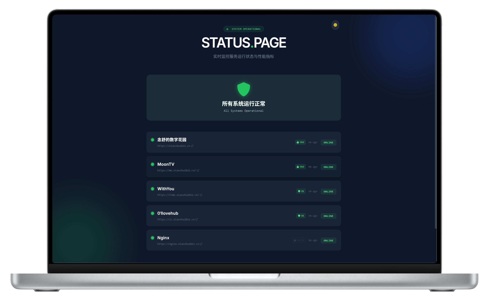
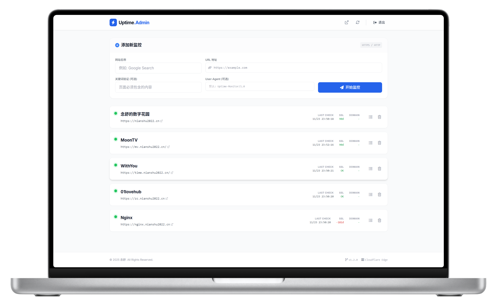

# Uptime Monitor

<div align="center">
  
  
  
  
</div>

<br>

**Uptime Monitor** 是基于 Cloudflare 生态（Workers + Pages + D1）构建的**完全免费**的轻量级网站监控系统。支持多站点监控、证书与域名过期检测、多渠道告警以及丰富的自定义配置。

## ✨ 核心特性

- **多站点高级监控**：HTTP/HTTPS 连通性检测，支持 GET/POST、自定义 Headers、请求 Body 以及关键词验证。
- **证书 & 域名监控**：自动检测 SSL 证书与域名有效期（由 RDAP 获取），支持独立开关与阈值控制。
- **丰富的告警渠道**：内置钉钉、企业微信、飞书、Telegram 机器人、Email 及自定义 Webhook。
- **告警频率策略**：按监控项独立设置"错误率阈值"告警，以及可用性/SSL/域名各自分离的恢复静默期。
- **事件公告发布**：在公开状态页提供维护或紧急事件发布面板。
- **现代化管理页面**：Dark OLED 风格管理后台与公开展示页，提供标签分类、批量操作、拖拽排序、自定义 Logo 及导入/导出 JSON 配置。
- **Serverless 零成本**：纯 Serverless 部署（Workers + D1 + Pages），数据私有化，无需服务器月费。
- **CI/CD 自动化**：内置 GitHub Actions，`git push` 即自动部署。

---

## 📸 界面预览

<div align="center">
  
  <br><em>公开状态页</em>
</div>

<br>

<div align="center">
  
  <br><em>管理后台（支持标签、批量操作与多渠道管理）</em>
</div>

---

## 🗺️ 部署路线图：选择适合你的方式

本项目支持 **两种部署方式**，请根据你的情况选择：

| | 方式 A：手动 CLI 部署 | 方式 B：GitHub Actions 自动部署 |
|---|---|---|
| **适合谁** | 首次部署 / 快速体验 | 长期维护 / 团队协作 |
| **操作方式** | 本地执行命令，一步步部署 | Fork 仓库 → 配置 Secrets → 推代码自动上线 |
| **更新方式** | 本地修改后手动重新 deploy | `git push` 到 `main` 分支自动触发 |
| **跳转** | [👇 方式 A：手动部署](#-方式-a手动-cli-部署完整步骤) | [👇 方式 B：自动部署](#-方式-bgithub-actions-自动部署) |

> **两种方式共享相同的前置准备**，请先完成下方的前置准备步骤。

---

## 📋 前置准备（两种方式都需要）

在开始部署前，请确保你已准备好以下内容：

### 1. 注册 Cloudflare 账号

前往 [cloudflare.com](https://www.cloudflare.com/) 注册免费账号（如果还没有的话）。

### 2. 安装 Node.js

前往 [nodejs.org](https://nodejs.org/) 下载并安装 **LTS 版本**（推荐 v20+）。

安装完成后，打开终端验证：

```bash
node -v    # 应输出 v20.x.x 或更高
npm -v     # 应输出 10.x.x 或更高
```

### 3. 安装并登录 Wrangler CLI

```bash
npm install -g wrangler
wrangler login
```

执行 `wrangler login` 后会自动打开浏览器，在 Cloudflare 页面点击 **Allow** 授权即可。

### 4. 克隆项目代码

```bash
git clone https://github.com/nianshu2022/Uptime-Monitor.git
cd Uptime-Monitor
```

### 5. 创建 D1 数据库

```bash
npx wrangler d1 create uptime-db
```

执行后终端会输出类似以下内容，**请复制 `database_id` 的值，后面要用**：

```
✅ Successfully created DB 'uptime-db'

[[d1_databases]]
binding = "DB"
database_name = "uptime-db"
database_id = "xxxxxxxx-xxxx-xxxx-xxxx-xxxxxxxxxxxx"   ← 复制这个 ID
```

### 6. 初始化数据库表结构

```bash
npx wrangler d1 execute uptime-db --remote --file=worker/schema.sql
```

> 这一步会在云端 D1 数据库中创建所需的表，只需执行一次。

---

至此，前置准备完成。请根据你选择的部署方式，跳转到对应章节：

- [方式 A：手动 CLI 部署](#-方式-a手动-cli-部署完整步骤)
- [方式 B：GitHub Actions 自动部署](#-方式-bgithub-actions-自动部署)

---

## 🅰️ 方式 A：手动 CLI 部署（完整步骤）

> 📝 **全局概览**：你将完成 4 个步骤：配置后端 → 部署后端 → 配置前端 → 部署前端。

### A-1. 配置后端 Worker

```bash
cd worker
cp wrangler.example.toml wrangler.toml
```

编辑 `worker/wrangler.toml`，替换以下两处：

```toml
[[d1_databases]]
binding = "DB"                     # ⚠️ 不要修改！代码中写死了 env.DB
database_name = "uptime-db"
database_id = "你的database_id"   # ← 替换为前置准备中复制的 ID

[vars]
ADMIN_API_KEY = "你自定义的登录口令"  # ← 设置管理后台密码，任意字符串
```

> [!WARNING]
> **`binding` 必须保持 `"DB"` 不变！** 请勿直接复制终端输出覆盖整段配置，否则后端代码会因找不到数据库绑定而报 500 错误。

### A-2. 部署后端 Worker

```bash
# 仍在 worker 目录下
npm install
npx wrangler deploy
```

部署成功后，终端会输出 Worker 地址，形如：

```
https://uptime-worker.你的子域名.workers.dev
```

**📋 请复制这个地址**，下一步要用。

### A-3. 配置前端环境变量

```bash
cd ../frontend
cp .env.example .env
```

编辑 `frontend/.env`，按需填入你的值（留空则不启用对应功能）：

```env
# Google AdSense（可选，留空则不注入广告脚本）
VITE_ADSENSE_CLIENT=

# Cloudflare Web Analytics（可选，留空则不注入统计脚本）
VITE_CF_ANALYTICS_TOKEN=

# 站点页脚作者信息
VITE_FOOTER_AUTHOR=Your Name
VITE_FOOTER_URL=https://your-website.com
```

### A-4. 构建并部署前端 Pages

```bash
# 仍在 frontend 目录下
npm install
npm run build
npx wrangler pages deploy dist --project-name=uptime-monitor
```

> 若提示项目不存在，wrangler 会自动创建。

### A-5. 设置 WORKER_URL 环境变量（关键！）

前端通过 Cloudflare Pages 内置代理将 `/api/*` 请求转发到后端 Worker，因此需要告诉前端你的后端地址。

**操作步骤**：

1. 打开 [Cloudflare Dashboard](https://dash.cloudflare.com/)
2. 进入 **Workers & Pages → uptime-monitor → Settings → Environment variables**
3. 点击 **Add variable**，Type 选择 `Text`，Variable name 填 `WORKER_URL`，Value 填你的 Worker 地址（如 `https://uptime-worker.xxx.workers.dev`）
4. 点击保存后**重新部署**使其生效：

```bash
npx wrangler pages deploy dist --project-name=uptime-monitor
```

### A-6. 验证部署 ✅

打开浏览器，分别访问以下地址：

| 测试项 | URL | 预期结果 |
|---|---|---|
| API 连通性 | `https://你的项目名.pages.dev/api/monitors/public` | 返回 JSON 数据（`[]` 或监控列表） |
| 公开状态页 | `https://你的项目名.pages.dev/` | 看到监控状态页面 |
| 管理后台 | `https://你的项目名.pages.dev/admin.html` | 看到登录页面，输入你设置的口令即可进入 |

**🎉 恭喜！手动部署完成。**

---

## 🅱️ 方式 B：GitHub Actions 自动部署

> 适合长期维护的场景：Fork 仓库到你自己的 GitHub 账号，配置好 Secrets 后，每次 `git push` 到 `main` 分支就会自动化部署 Worker + Pages。

### B-1. Fork 仓库

在 GitHub 上 Fork [本仓库](https://github.com/nianshu2022/Uptime-Monitor) 到你自己的账号下。

### B-2. 获取 Cloudflare API Token

1. 登录 [Cloudflare Dashboard](https://dash.cloudflare.com/)
2. 点击右上角头像 → **My Profile → API Tokens → Create Token**
3. 选择 **Custom token**，添加以下权限：

| 权限 | 授权级别 |
|---|---|
| Account / Cloudflare Pages | Edit |
| Account / D1 | Edit |
| Account / Workers Scripts | Edit |

4. 创建后**复制 Token**（只显示一次！）。

5. 同时在 Dashboard 首页找到并复制你的 **Account ID**（页面右侧边栏）。

### B-3. 配置 GitHub Secrets 和 Variables

进入你 Fork 后的仓库 → **Settings → Secrets and variables → Actions**。

#### Secrets（加密敏感信息）

点击 **New repository secret**，逐一添加：

| Secret 名称 | 值 | 必填 |
|---|---|---|
| `CLOUDFLARE_API_TOKEN` | 上一步获取的 API Token | ✅ |
| `CLOUDFLARE_ACCOUNT_ID` | 你的 Cloudflare Account ID | ✅ |
| `D1_DATABASE_ID` | 前置准备中创建的 D1 数据库 ID | ✅ |
| `ADMIN_API_KEY` | 管理后台登录口令（自定义） | ✅ |
| `VITE_ADSENSE_CLIENT` | Google AdSense client ID | ❌ 可选 |
| `VITE_CF_ANALYTICS_TOKEN` | Cloudflare Analytics token | ❌ 可选 |

#### Variables（非敏感配置）

切换到 **Variables** 选项卡，点击 **New repository variable**：

| Variable 名称 | 值 | 必填 |
|---|---|---|
| `VITE_FOOTER_AUTHOR` | 页脚作者名 | ❌ 可选 |
| `VITE_FOOTER_URL` | 页脚作者链接 | ❌ 可选 |

### B-4. 触发部署

配置好后，有两种方式触发部署：

**方式一**：推送代码到 `main` 分支（会自动触发）
```bash
git add .
git commit -m "init: configure deployment"
git push origin main
```

**方式二**：手动触发
1. 进入仓库的 **Actions** 页面
2. 点击左侧的 **Deploy Uptime Monitor** 工作流
3. 点击 **Run workflow**

### B-5. 设置 WORKER_URL 环境变量（关键！）

> 与方式 A 相同，前端需要知道后端地址才能转发 API 请求。

1. 部署完成后，在 Cloudflare Dashboard → **Workers & Pages** 中找到你的 Worker，复制其 URL（形如 `https://uptime-worker.xxx.workers.dev`）
2. 进入 **Workers & Pages → uptime-monitor → Settings → Environment variables**
3. 点击 **Add variable**，Type 选择 `Text`，Variable name 填 `WORKER_URL`，Value 填你的 Worker 地址，保存
4. 回到 GitHub，重新触发一次 Actions（或 `git push` 一次），使前端重新部署以读取到新的环境变量

### B-6. 验证部署 ✅

与方式 A 相同，访问以下地址验证：

| 测试项 | URL | 预期结果 |
|---|---|---|
| API 连通性 | `https://你的项目名.pages.dev/api/monitors/public` | 返回 JSON |
| 公开状态页 | `https://你的项目名.pages.dev/` | 监控状态页 |
| 管理后台 | `https://你的项目名.pages.dev/admin.html` | 登录页面 |

**🎉 恭喜！自动部署配置完成。以后修改代码只需 `git push`，GitHub Actions 会自动部署。**

---

## 💻 本地开发

> 如果你想在本地修改代码进行调试，只需启动两个终端：

**终端 1 — 启动后端 Worker：**
```bash
cd worker
npm install
npm run dev
# Worker 运行在 http://127.0.0.1:8787
```

**终端 2 — 启动前端 Vite 开发服务器：**
```bash
cd frontend
npm install
npm run dev
# 前端运行在 http://localhost:5173
# Vite 自动将 /api/* 请求代理到后端 Worker
```

然后在浏览器访问：
- 公开状态页：`http://localhost:5173/`
- 管理后台：`http://localhost:5173/admin.html`

> 💡 本地开发使用的是本地 SQLite 模拟 D1，数据与线上互相隔离，可放心调试。

---

## 🌏 国内访问说明

> `workers.dev` 域名在中国大陆被封锁，直接将 Worker 地址分享给国内用户会导致连接超时。

本项目已内置解决方案：前端部署在 `*.pages.dev`（国内可正常访问），通过 `_worker.js` 在 Cloudflare 内部将 API 请求代理到后端 Worker，**用户无需翻墙即可使用**。

如需绑定自定义域名（体验更稳定），在 Cloudflare Dashboard 中：
- **后端**：Worker → Settings → Domains & Routes → Add Custom Domain
- **前端**：Pages → uptime-monitor → Custom domains → Set up a custom domain

---

## 🛠️ 技术栈

| 模块 | 实现方案 |
|---|---|
| **API 服务层** | Cloudflare Workers + [Hono](https://hono.dev/) |
| **持久层 / 数据库** | Cloudflare D1 (Serverless SQLite) |
| **前端构建** | [Vite](https://vite.dev/) (多页面模式) |
| **前端 UI** | Vue 3 (CDN) + Tailwind CSS (CDN) |
| **CI/CD** | GitHub Actions → Cloudflare |
| **第三方探针接口** | `crt.sh` (SSL) · `rdap.org` (域名期限) |

---

## 📝 常见问题（FAQ）

<details>
<summary><b>Q：如何添加通知渠道？</b></summary>

进入管理后台右上角的「通知渠道」，可视化添加钉钉、企微、飞书、Telegram、Email、Webhook。添加后点击「测试」验证配置。
</details>

<details>
<summary><b>Q：为什么 SSL 证书有效期没有显示？</b></summary>

证书信息由 Cron 每天定时从 `crt.sh` 拉取，首次添加监控后请等待下一次 Cron 触发（最多 24 小时）。你也可以手动触发：

```bash
curl "https://你的Worker地址/cdn-cgi/handler/scheduled"
```
</details>

<details>
<summary><b>Q：修改了站点设置但前端没变化？</b></summary>

请强制刷新页面（`Ctrl + Shift + R`）。如果仍没变化，清除 Cloudflare CDN 缓存：Dashboard → Caching → Purge Cache。
</details>

<details>
<summary><b>Q：访问 /api/monitors/public 仍然显示前端页面？</b></summary>

说明 `WORKER_URL` 未生效。请确认：
1. 在 Cloudflare Dashboard 的 Pages 项目中 **正确设置了 `WORKER_URL` 环境变量**
2. Production 和 Preview 环境都已设置
3. 设置后**重新部署**了一次前端
</details>

<details>
<summary><b>Q：后端抛出 500 错误，提示 Cannot read properties of undefined (reading 'prepare')？</b></summary>

这是 D1 数据库未成功绑定。请根据你的部署方式检查：

- **命令行部署**：检查 `wrangler.toml` 中 `binding` 必须是 `"DB"`，`database_id` 没有填错，然后重新 `npx wrangler deploy`。
- **GitHub Actions 部署**：检查 GitHub Secrets 中的 `D1_DATABASE_ID` 是否正确。
- **Cloudflare 面板手动部署**：进入 Worker → Settings → Bindings，手动添加 D1 Database 绑定，变量名必须是 `DB`。
</details>

<details>
<summary><b>Q：本地开发时 Worker 启动报警告 "Neither ADMIN_API_KEY nor ADMIN_PASSWORD is set"？</b></summary>

这是因为本地 `wrangler.toml` 中没有配置认证口令。在 `[vars]` 段添加 `ADMIN_API_KEY = "你的口令"` 即可消除警告。本地开发中，即使不设置也不影响基本功能调试。
</details>

---

## 📁 目录结构

```
Uptime-Monitor/
├── frontend/                  # 前端（Vite 构建）
│   ├── public/
│   │   └── _worker.js         # Cloudflare Pages 边缘函数（API 代理）
│   ├── index.html             # 公开状态页
│   ├── admin.html             # 管理后台
│   ├── vite.config.js         # Vite 配置（含开发代理）
│   ├── .env.example           # 环境变量示例
│   └── package.json
├── worker/                    # 后端 Worker
│   ├── src/index.ts           # API 源码（Hono 框架）
│   ├── schema.sql             # 数据库建表脚本
│   ├── wrangler.example.toml  # Worker 配置示例
│   └── package.json
├── .github/workflows/
│   └── deploy.yml             # CI/CD 自动部署工作流
└── README.md
```

---

## 📄 License

MIT License © 2025 Uptime Monitor
