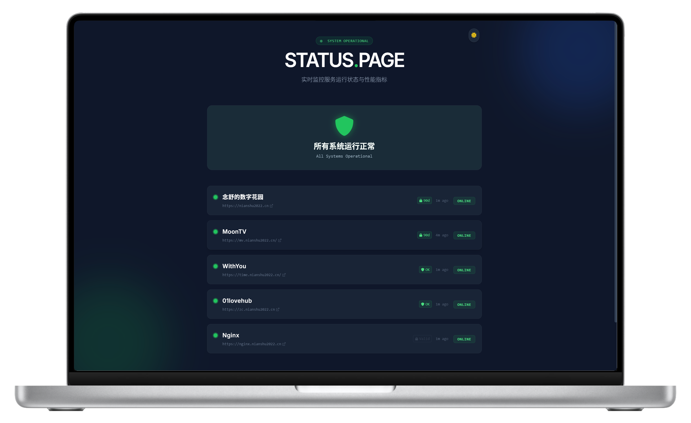
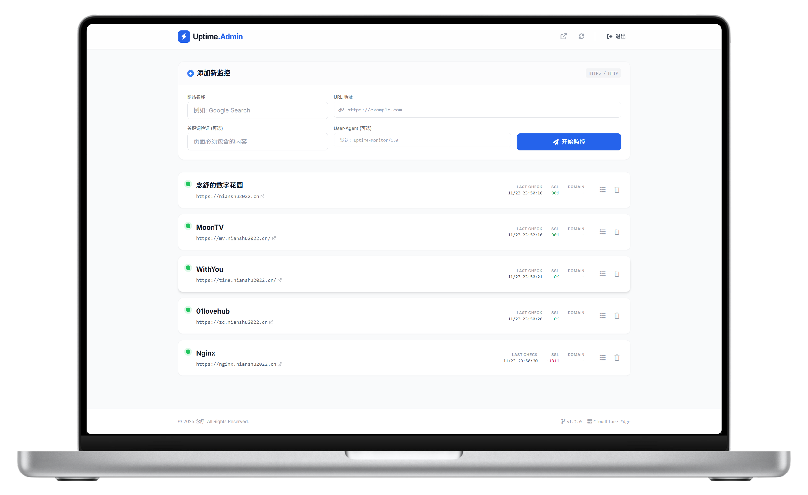

# Uptime Monitor

[English](README.en.md) | 中文

Uptime Monitor 是一个基于 Cloudflare Workers、Pages 和 D1 的轻量级网站监控系统。它支持多站点可用性监控、SSL 证书和域名到期检测、多渠道告警、公开状态页以及管理后台，适合个人站点、小团队和轻量级服务监控。

项目依赖 Cloudflare 免费额度即可运行，不需要自建服务器。前端已移除 Google Fonts、运行时图标 CDN 等海外依赖，默认使用本地打包字体和图标，更适合国内用户访问。

## 适合谁

- 个人站长：监控博客、文档站、API、图床、反代服务等。
- 独立开发者：给自己的产品准备一个公开状态页和告警后台。
- 小团队：用低成本方式监控网站、证书、域名和关键 HTTP 服务。
- Cloudflare 用户：希望直接跑在 Workers、Pages 和 D1 上，不额外维护服务器。

不适合需要复杂探针网络、企业级 SLO 报表、值班排班和多租户权限的大型团队。

## 功能特性

- 多站点 HTTP/HTTPS 监控，支持 GET/POST、自定义 Header、请求 Body 和关键词校验。
- SSL 证书与域名到期检测，支持独立开关和提前提醒阈值。
- 支持企业微信、飞书、钉钉、自定义 Webhook、Telegram 和 Email 告警。
- 告警模板可配置，恢复通知和异常通知分离。
- 公开状态页支持标签分组、事件公告、计划维护和自定义 Logo。
- 管理后台支持批量操作、拖拽排序、配置导入导出和健康检查。
- 管理接口使用登录会话令牌，避免前端长期保存明文口令。
- Worker 和 Pages 代理支持 `ALLOWED_ORIGIN`，可收紧跨域来源。
- GitHub Actions 自动部署 Worker 和 Pages。

## 快速了解

| 问题 | 回答 |
|---|---|
| 是否需要服务器 | 不需要，部署到 Cloudflare Workers、Pages 和 D1 |
| 是否需要数据库 | 需要 Cloudflare D1 |
| 是否支持公开状态页 | 支持 |
| 是否支持后台管理 | 支持，路径为 `/admin` |
| 是否支持告警 | 支持企业微信、飞书、钉钉、Webhook、Telegram、Email |
| 是否适合国内用户 | 前端资源本地打包，通知渠道优先推荐企业微信、飞书、钉钉 |
| 在线 Demo | [https://uptime.nianshu2022.cn](https://uptime.nianshu2022.cn) |

## 在线演示

- 状态页：[https://uptime.nianshu2022.cn](https://uptime.nianshu2022.cn)
- 管理后台：[https://uptime.nianshu2022.cn/admin](https://uptime.nianshu2022.cn/admin)
- 演示密码：`Qwer1234`

演示密码仅用于公开 Demo，请不要作为自己的生产环境管理口令。

## 相关项目

- [MonitorFlare](https://github.com/xusteve/MonitorFlare)：基于本项目的增强分支，利用 Cloudflare Workers + D1 + Pages 免费层实现零成本监控与公开状态页，支持多语言与多种通知渠道。演示：[https://monitorflare.csr.plus](https://monitorflare.csr.plus)

## 界面预览

<div align="center">
  
  <br>
  <em>公开状态页</em>
</div>

<br>

<div align="center">
  
  <br>
  <em>管理后台</em>
</div>

## 技术栈

| 模块 | 技术 |
|---|---|
| 后端 | Cloudflare Workers + Hono |
| 数据库 | Cloudflare D1 |
| 前端 | Vue 3 + Vite + Tailwind CSS |
| 边缘代理 | Cloudflare Pages Functions |
| 部署 | Wrangler + GitHub Actions |

## 前置要求

- Cloudflare 账号
- Node.js 22 或更高版本
- npm
- Wrangler CLI

```bash
npm install -g wrangler
wrangler login
```

克隆项目：

```bash
git clone https://github.com/nianshu2022/Uptime-Monitor.git
cd Uptime-Monitor
```

## 创建 D1 数据库

新建数据库：

```bash
npx wrangler d1 create uptime-db
```

命令输出中会包含 `database_id`，后续部署需要使用：

```toml
[[d1_databases]]
binding = "DB"
database_name = "uptime-db"
database_id = "xxxxxxxx-xxxx-xxxx-xxxx-xxxxxxxxxxxx"
```

初始化表结构：

```bash
npx wrangler d1 execute uptime-db --remote --file=worker/schema.sql
```

如果数据库之前已经创建过，可以在 Cloudflare Dashboard 的 D1 数据库详情页复制 Database ID，也可以执行：

```bash
npx wrangler d1 list
```

已有数据库升级时，请重新执行 `worker/schema.sql`。其中 `CREATE INDEX IF NOT EXISTS` 会补齐新增索引，不会重复创建。

## 部署前检查清单

上线前请确认下面 4 项都已完成：

- 远程 D1 已执行 `worker/schema.sql`。
- Worker 已绑定 D1，且绑定名是 `DB`。
- Worker 已配置 `ADMIN_API_KEY`。
- Pages 已配置 `WORKER_URL`，并在保存后重新部署前端。

如果少了最后一步，登录接口会返回：

```json
{"error":"WORKER_URL environment variable is not set"}
```

如果少了 D1 初始化，公开接口或登录后的管理接口可能返回：

```json
{"error":"D1_ERROR: no such table: monitors: SQLITE_ERROR"}
```

## 手动部署

### 1. 配置并部署 Worker

```bash
cd worker
npm install
cp wrangler.example.toml wrangler.toml
```

编辑 `worker/wrangler.toml`：

```toml
[[d1_databases]]
binding = "DB"
database_name = "uptime-db"
database_id = "你的 D1_DATABASE_ID"

[vars]
ADMIN_API_KEY = "你的管理后台登录口令"
ALLOWED_ORIGIN = "https://你的-pages域名.pages.dev"
SESSION_TTL_HOURS = "12"
```

注意：`binding` 必须保持为 `DB`。

部署 Worker：

```bash
npx wrangler deploy
```

部署完成后复制 Worker 地址，例如：

```text
https://uptime-worker.example.workers.dev
```

### 2. 构建并部署前端

```bash
cd ../frontend
npm install
cp .env.example .env
npm run build
npx wrangler pages deploy dist --project-name=uptime-monitor
```

### 3. 配置 Pages 环境变量

进入 Cloudflare Dashboard：

`Workers & Pages` -> `uptime-monitor` -> `Settings` -> `Environment variables`

添加：

| 变量 | 说明 |
|---|---|
| `WORKER_URL` | Worker 地址，例如 `https://uptime-worker.example.workers.dev` |
| `ALLOWED_ORIGIN` | Pages 地址，例如 `https://uptime-monitor.pages.dev` |

保存后重新部署前端：

```bash
npx wrangler pages deploy dist --project-name=uptime-monitor
```

验证代理是否生效：

```bash
curl https://你的-pages域名.pages.dev/api/monitors/public
```

正常情况下会返回 `[]` 或监控列表。如果返回 `WORKER_URL environment variable is not set`，说明 Pages 环境变量未配置或配置后没有重新部署。

## GitHub Actions 自动部署

Fork 本仓库后，在 GitHub 仓库的 `Settings` -> `Secrets and variables` -> `Actions` 中配置以下内容。

### Secrets

| 名称 | 必填 | 说明 |
|---|---|---|
| `CLOUDFLARE_API_TOKEN` | 是 | Cloudflare API Token |
| `CLOUDFLARE_ACCOUNT_ID` | 是 | Cloudflare Account ID |
| `D1_DATABASE_ID` | 是 | D1 数据库 ID |
| `ADMIN_API_KEY` | 是 | 管理后台登录口令 |
| `VITE_CF_ANALYTICS_TOKEN` | 否 | Cloudflare Web Analytics Token |

Cloudflare API Token 至少需要这些权限：

| 权限 | 级别 |
|---|---|
| Account / Workers Scripts | Edit |
| Account / Cloudflare Pages | Edit |
| Account / D1 | Edit |
| Account / Account Settings | Read |

### Variables

| 名称 | 必填 | 说明 |
|---|---|---|
| `ALLOWED_ORIGIN` | 推荐 | Pages 地址，用于限制跨域来源 |
| `SESSION_TTL_HOURS` | 否 | 登录会话有效期，默认 12 小时 |
| `VITE_FOOTER_AUTHOR` | 否 | 页脚作者名 |
| `VITE_FOOTER_URL` | 否 | 页脚作者链接 |

配置完成后，推送到 `main` 分支或在 Actions 页面手动运行 `Deploy Uptime Monitor` 工作流。

首次部署完成后，还必须在 Cloudflare Pages 项目中添加 `WORKER_URL` 环境变量，然后重新部署一次前端。GitHub Secrets 里的 `D1_DATABASE_ID` 只用于 Worker 绑定，不会自动给 Pages 配置后端地址。

操作路径：

`Cloudflare Dashboard` -> `Workers & Pages` -> `uptime-monitor` -> `Settings` -> `Environment variables`

添加：

| 变量 | 值 |
|---|---|
| `WORKER_URL` | Worker 地址，例如 `https://uptime-worker.example.workers.dev` |
| `ALLOWED_ORIGIN` | Pages 地址，例如 `https://uptime-monitor.pages.dev` |

保存后回到 GitHub Actions 重新运行一次部署，或本地执行：

```bash
cd frontend
npm run build
npx wrangler pages deploy dist --project-name=uptime-monitor
```

## 本地开发

启动 Worker：

```bash
cd worker
npm install
npm run dev
```

启动前端：

```bash
cd frontend
npm install
npm run dev
```

访问：

- 状态页：`http://localhost:5173/`
- 管理后台：`http://localhost:5173/admin`
- Worker：`http://127.0.0.1:8787`

## 国内访问说明

`workers.dev` 域名在中国大陆可能无法直接访问。推荐将前端部署到 Cloudflare Pages，并通过 Pages 内置代理把 `/api/*` 请求转发到 Worker。

如需更稳定访问，可以绑定自定义域名：

- Worker：`Workers & Pages` -> Worker -> `Settings` -> `Domains & Routes`
- Pages：`Workers & Pages` -> Pages 项目 -> `Custom domains`

项目不依赖需要付费的第三方服务。Telegram、Email、`crt.sh`、`rdap.org` 等外部服务可能受网络环境影响，国内用户建议优先使用企业微信、飞书、钉钉或自定义 Webhook。

## 常见问题

### GitHub Actions 提示 Cloudflare Authentication error

通常是 GitHub Secrets 配置错误或 API Token 权限不足。请检查：

- `CLOUDFLARE_API_TOKEN` 是否正确。
- `CLOUDFLARE_ACCOUNT_ID` 是否正确。
- API Token 是否包含 Workers、Pages、D1 和 Account Settings 权限。
- Token 的账号资源范围是否包含目标 Cloudflare 账号。

### Worker 报错 Cannot read properties of undefined (reading 'prepare')

说明 D1 没有正确绑定。请检查：

- `worker/wrangler.toml` 中 `binding` 是否为 `DB`。
- `database_id` 是否填写正确。
- GitHub Actions 中 `D1_DATABASE_ID` 是否已配置。

### 登录后台提示认证未配置

请配置 `ADMIN_API_KEY`。本项目兼容旧的 `ADMIN_PASSWORD`，但推荐使用 `ADMIN_API_KEY`。

### `/api/monitors/public` 返回前端页面

说明 Pages 代理没有拿到 Worker 地址。请在 Cloudflare Pages 环境变量中配置 `WORKER_URL`，保存后重新部署前端。

### 登录接口返回 500，并提示 WORKER_URL environment variable is not set

这是 Pages 项目缺少 `WORKER_URL`。请在 Cloudflare Pages 项目环境变量中添加：

```text
WORKER_URL=https://你的 Worker 地址
```

保存后必须重新部署 Pages，否则新变量不会生效。

### 接口返回 D1_ERROR: no such table: monitors

说明当前 Worker 绑定的 D1 数据库还没有初始化表结构，或 `D1_DATABASE_ID` 绑定到了另一个空库。

先确认 D1：

```bash
npx wrangler d1 list
```

然后初始化远程数据库：

```bash
npx wrangler d1 execute uptime-db --remote --file=worker/schema.sql
```

## 目录结构

```text
Uptime-Monitor/
├── frontend/
│   ├── public/
│   │   └── _worker.js
│   ├── index.html
│   ├── src/
│   ├── vite.config.js
│   └── package.json
├── worker/
│   ├── src/index.ts
│   ├── schema.sql
│   ├── wrangler.example.toml
│   └── package.json
├── .github/workflows/
│   └── deploy.yml
├── docs/
│   └── LAUNCH.md
├── README.md
├── README.en.md
└── LICENSE
```

## 许可证

本项目基于 [MIT License](LICENSE) 开源。
